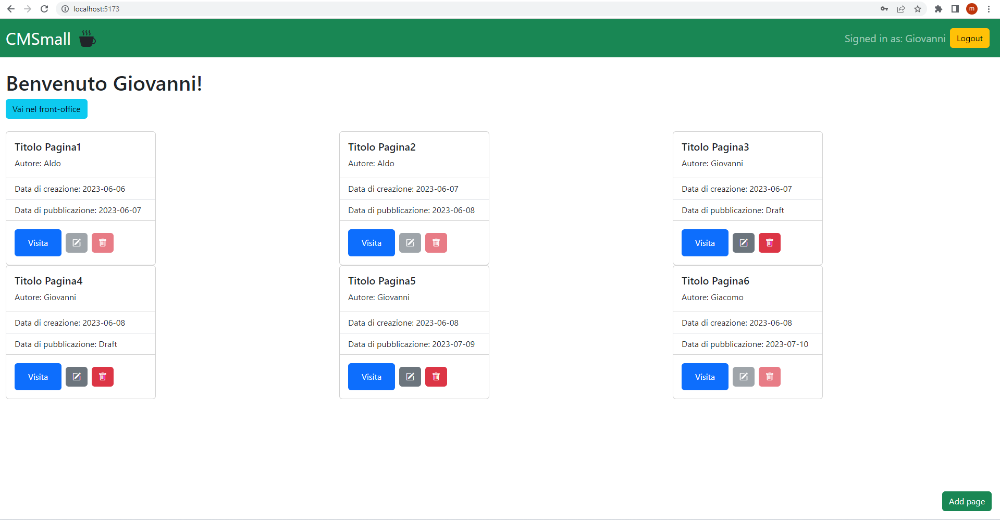
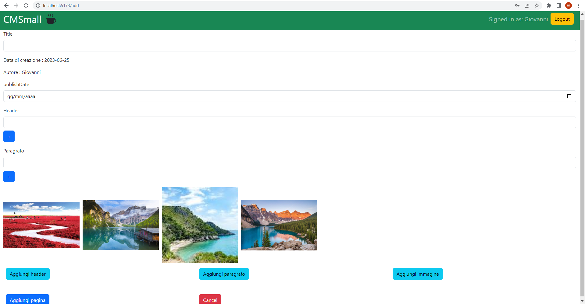

[](https://classroom.github.com/a/suhcjUE-)
# Exam #1: "CMSmall"
## Student: s314786 MARTINI MATTEO

## React Client Application Routes

- Route `/`: Utilizzata sia per il back-office che per il front-office. Nel front-office mostra le pagine pubblicate mentre nel back-office (dopo aver fatto l'accesso) tutte le pagine create e modificabili a seconda dei casi descritti nel testo.
- Route `/page/:pageId`: Utilizzata per visualizzare il contenuto delle pagine.
- Route `/add` : Utilizzata per aggiungere una nuova pagina, dopo aver compilato i vari campi necessari.
- Route `/edit/:pageId` : Utilizzata per modificare il contenuto di pagina esistente.
- Route `/login` : Utilizzata per il login degli users
- Route `/*` : Utilizzata per gestire le routes invalide. Viene mostrato un messaggio di errore per far capire il problema.

## API Server

### __List Pages__

URL: `/api/pages`

Method: GET

Description: Get all the pages.

Request body: _None_

Response: `200 OK` (success) or `500 Internal Server Error` (generic error).

Response body: An array of objects, each describing a page and its blocks.
```
[{
    "id": 1,
    "title": "Titolo pagina1",
    "authorId": 1,
    "creationDate": "2023-06-06",
    "publishDate": "2023-06-07",
    blocks: [{      id: 1,                    
                    type: "header",
                    orderIndex: 1,
                    content: "header esempio1",
                    imagePath: "",},
                    ...],
},
...
]
```

### __List Images__

URL: `/api/images`

Method: GET

Description: Get all the images.

Request body: _None_

Response: `200 OK` (success) or `500 Internal Server Error` (generic error).

Response body: An array of objects, each describing a image.
```
[{
    "id": 1,
    "imagePath": "/img1.jpg",
},
...
]
```


### __Get Authors__

URL: `/api/authors`

Method: GET

Description: Get all users in the database. A cookie with a VALID SESSION ID must be provided to get the info of the user authenticated in the current session and verify if is an administrator.

Request body: _None_

Response: `200 OK` (success)  or `500 Internal Server Error` (generic error).

Response body: An array of objects, each describing a user.
```
[
{
"email": "luca@test.com",
"id": 4,
"name": "Luca",
},
{
"email": "aldo@test.com",
"id": 1,
"name": "Aldo",
}
]
```


### __Get Title__

URL: `/api/title`

Method: GET

Description: Get the title of the site.

Request body: _None_

Response: `200 OK` (success),  or `500 Internal Server Error` (generic error).

Response body: An object, describing the title.
```
{
    "id": 1,
    "titleName": "CMSmall"
}
```

### __Add a New Page__

URL: `/api/pages`

Method: POST

Description: Add a new page to the list of pages. A cookie with a VALID SESSION ID must be provided. The user adding the page is taken from the session. If the user is administrator he can provide the author of the page.

Request body: An object representing a page (Content-Type: `application/json`).
```
{
    id: 7,
    title: "pagina 7",
    authorId: 1,
    authorName: "Aldo",
    creationDate: "25/06/2023",
    publishDate: "",
    blocks: [{      id: 1,
                    type: "header",
                    orderIndex: 1,
                    content: "header esempio1",
                    imagePath: "",},
                    ...],
}
```

Response: `201 Created` (success) or `503 Service Unavailable` (generic error). If the request body is not valid, `422 Unprocessable Entity` (validation error). If the pageId does not exist, `404 Not Found`. If the request does not come on an authenticated session, `401 Unauthorized`.

Response body: The id of the newly created page, as a JSON value (Content-Type: `application/json`).

```
7
```


### __Update a Page__

URL: `/api/pages/<id>`

Method: PUT

Description: Update an existing page entirely, identified by its id. A cookie with a VALID SESSION ID must be provided. The user requesting the update the page must be the same as the page owner or can be an administrator.

Request body:  An object representing a page (Content-Type: `application/json`).
```
{
  id: 1,
  title: "Titolo pagina1",
  authorId: 1,
  author: "Aldo",
  creationDate: "06/06/2023",
  publishDate: "07/06/2023",
  blocks: [{      id: 1,
                  type: "header",
                  orderIndex: 1,
                  content: "header esempio1",
                  imagePath: "",},
                  ...],
}
```

Response: `200 OK` (success) or `503 Service Unavailable` (generic error). If the request body is not valid, `422 Unprocessable Entity` (validation error). If the request does not come on an authenticated session, `401 Unauthorized`.

Response body: _None_


### __Delete a Page__

URL: `/api/pages/<id>`

Method: DELETE

Description: Delete an existing page, identified by its id. A cookie with a VALID SESSION ID must be provided. The user requesting the deletion the page must be the same that owns the page or an administrator.

Request body: _None_

Response: `204 No Content` (success) or `503 Service Unavailable` (generic error). If the request does not come on an authenticated session, `401 Unauthorized`.

Response body: _None_


### __Update title__

URL: `/api/title`

Method: PUT

Description: Update the website title. A cookie with a VALID SESSION ID must be provided. The user requesting the
      title update must be an administrator.

Request body:  An object representing the title (Content-Type: `application/json`).
```
{
    id: 1,
    titleName: "CSM",
}
```

Response: `200 OK` (success) or `503 Service Unavailable` (generic error). If the request body is not valid, `422 Unprocessable Entity` (validation error). If the request does not come on an authenticated session, `401 Unauthorized`.

Response body: _None_


### __Create a new session (login)__

URL: `/api/sessions`

HTTP Method: POST

Description: Create a new session starting from given credentials.

Request body:
```
{
  "username": "aldo@test.com",
  "password": "pwd"
}
```

Response: `200 OK` (success) or `500 Internal Server Error` (generic error).

Response body: _None_


### __Get the current session if existing__

URL: `/api/sessions/current`

HTTP Method: GET

Description: Verify if the given session is still valid and return the info about the logged-in user. A cookie with a VALID SESSION ID must be provided to get the info of the user authenticated in the current session.

Request body: _None_ 

Response: `201 Created` (success) or `401 Unauthorized` (error).

Response body:
```
{
  "username": "giovanni@test.com",
  "id": 4,
  "name": "Giovanni"
}
```

### __Destroy the current session (logout)__

URL: `/api/sessions/current`

HTTP Method: DELETE

Description: Delete the current session. A cookie with a VALID SESSION ID must be provided.

Request body: _None_

Response: `200 OK` (success) or `500 Internal Server Error` (generic error).

Response body: _None_

## Database Tables

- Table `users` : (id, email, name, salt, password)
- Table `pages` : (id, title, authorId, creationDate, publishDate)
- Table `content_blocks` : (id, pageId, type, orderIndex, content, imagePath)
- Table `images` : (id, imagePath)
- Table `title` : (id, titleName)

## Main React Components

- `NavBar` (in `Navbar.jsx`): Presenta il titolo, un'icona e il bottone per il login/logout. In caso di autenticazione con l'amministratore, spunta il bottone per poter cambiare il titolo e successivamente un piccolo Form in cui scriverlo. 
- `LoginForm` (in `Login.jsx`): Componente utilizzato per il login di un utente, presenta i form per inserire email e password.
- `CMS` (in `PrincipalRoute.jsx`): Associato alla route '/', è il componente che si occupa di visualizzare le varie pagine (appoggiandosi al componente Pagina che le mostra singolarmente). Inoltre presenta al suo interno anche i vari bottoni per poter modificare/eliminare/aggiungere pagine a seconda della situazione, e il bottone per fare lo switch tra back-office e front-office.
- `PageVisualized` (in `PageView.jsx`): Associato alla route '/page/:pageId', viene utilizzato unicamente per mostrare i blocchi contenuti in una pagina. Vi si accede tramite il bottone 'Visita'.
- `FormPage` (in `PageForm.jsx`): Componente utilizzato creare o modificare una pagina. Presenta i Form per inserire tutti i campi necessari alla creazione di una pagina inseribili dall'utente, compresi i vari tipi di blocchi, ordinabili durante la creazione.

## Screenshot




## Users Credentials

- username:  aldo@test.com, password: "pwd"
- username:  giovanni@test.com, password: "pwd"
- username:  giacomo@test.com, password: "pwd"
- username:  luca@test.com, password: "pwd"
- username:  paolo@test.com, password: "pwd"

